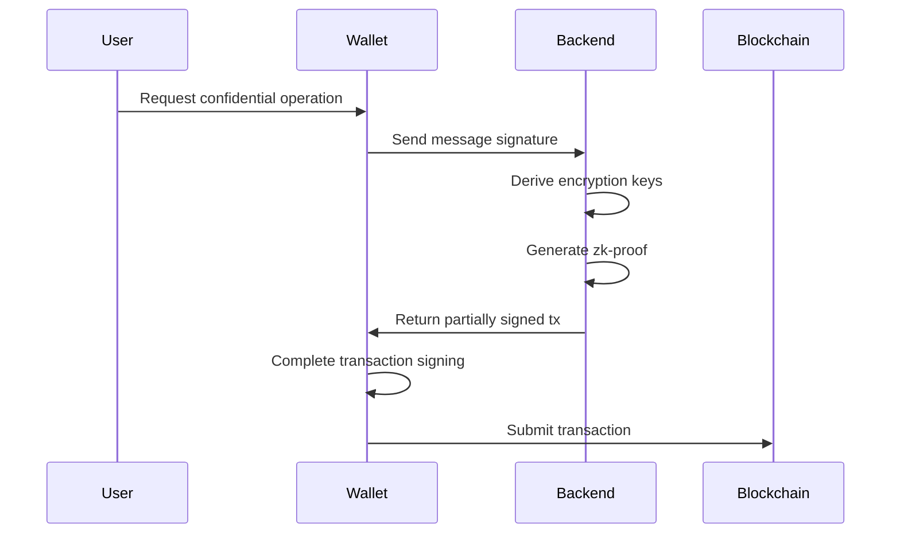
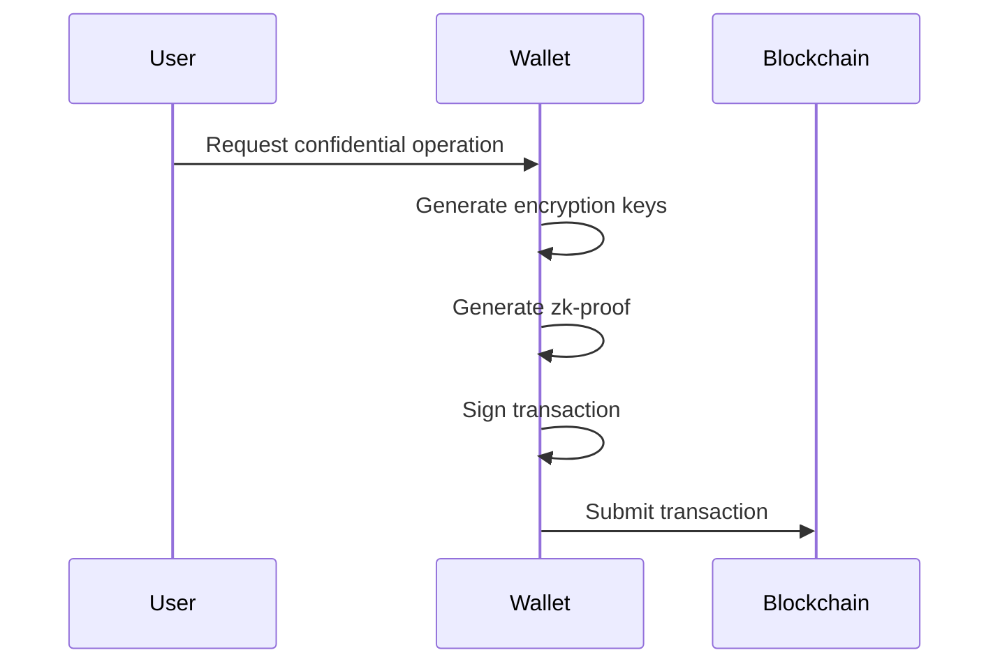

# Confidential Balances Token Extension Reference Implementation

A reference implementation demonstrating the **Confidential Balances features** from Solana Program Library's Token22. This project features a Rust backend (Axum) and a React frontend (Next.js).

## Implementation Types

### Trusted Implementation (This Project)
This is a **trusted** implementation that demonstrates UX possibilities for confidential balances operations on self-custodial wallets. The trust model works as follows:

- The backend receives the user's wallet message signature
- This signature serves as the seed for deriving ElGamal & AES encryption keys
- The backend handles zero-knowledge proof generation using these derived keys
- The backend returns partially signed transactions for the wallet to complete

**Suitable For:**
- Custodial wallet services
- Wallet-as-a-Service (WaaS) providers
- Trusted self-custodial wallets (read security considerations below)



### Trustless Implementation
A trustless implementation would:
- Generate and manage encryption keys entirely within the wallet
- Handle zero-knowledge proof generation internally
- Never expose encryption keys or their seeds to external services

**Current Status:**
- Rust-based wallets: Available now by implementing the [backend](backend) directly into the wallet client
- TypeScript wallets: Coming soon with the release of the [ElGamal Proof library](https://github.com/solana-program/zk-elgamal-proof/tree/main/clients/js-legacy#solanazk-elgamal-proof)



## ⚠️ Important Security Considerations

Trusted implementations require handling sensitive cryptographic operations on the backend. This introduces important security requirements:

1. **Key Derivation Security**
   - The backend derives encryption keys from user-provided seeds
   - These seeds must be transmitted securely and never stored
   - HTTPS is mandatory for all client-backend communication

2. **Backend Security Requirements**
   - Deploy in secure, restricted environments (e.g., Google Cloud Run, secure enclaves)
   - No caching or persistence of sensitive cryptographic material
   - Regular security audits and monitoring

3. **Trust Implications**
   - Users must trust the backend implementation
   - Backend has theoretical capability to decrypt user balances
   - Consider implementing additional audit mechanisms

## Live Demo

Check out the deployed version here: https://confidential-balances-microsite-peach.vercel.app

![Preview](data:image/*;base64,iVBORw0KGgoAAAANSUhEUgAABngAAATfCAYAAABuNpjKAAAACXBIWXMAABYlAAAWJQFJUiTwAAAKT2lDQ1BQaG90b3Nob3AgSUNDIHByb2ZpbGUAAHjanVNnVFPpFj333vRCS4iAlEtvUhUIIFJCi4AUkSYqIQkQSoghodkVUcERRUUEG8igiAOOjoCMFVEsDIoK2AfkIaKOg6OIisr74Xuja9a89+bN/rXXPues852zzwfACAyWSDNRNYAMqUIeEeCDx8TG4eQuQIEKJHAAEAizZCFz/SMBAPh+PDwrIsAHvgABeNMLCADATZvAMByH/w/qQplcAYCEAcB0kThLCIAUAEB6jkKmAEBGAYCdmCZTAKAEAGDLY2LjAFAtAGAnf+bTAICd+Jl7AQBblCEVAaCRACATZYhEAGg7AKzPVopFAFgwABRmS8Q5ANgtADBJV2ZIALC3AMDOEAuyAAgMADBRiIUpAAR7AGDIIyN4AISZABRG8lc88SuuEOcqAAB4mbI8uSQ5RYFbCC1xB1dXLh4ozkkXKxQ2YQJhmkAuwnmZGTKBNA/g88wAAKCRFRHgg/P9eM4Ors7ONo62Dl8t6r8G/yJiYuP+5c+rcEAAAOF0ftH+LC+zGoA7BoBt/qIl7gRoXgugdfeLZrIPQLUAoOnaV/Nw+H48PEWhkLnZ2eXk5NhKxEJbYcpXff5nwl/AV/1s+X48/Pf14L7iJIEyXYFHBPjgwsz0TKUcz5IJhGLc5o9H/LcL//wd0yLESWK5WCoU41EScY5EmozzMqUiiUKSKcUl0v9k4t8s+wM+3zUAsGo+AXuRLahdYwP2SycQWHTA4vcAAPK7b8HUKAgDgGiD4c93/+8//UegJQCAZkmScQAAXkQkLlTKsz/HCAAARKCBKrBBG/TBGCzABhzBBdzBC/xgNoRCJMTCQhBCCmSAHHJgKayCQiiGzbAdKmAv1EAdNMBRaIaTcA4uwlW4Dj1wD/phCJ7BKLyBCQRByAgTYSHaiAFiilgjjggXmYX4IcFIBBKLJCDJiBRRIkuRNUgxUopUIFVIHfI9cgI5h1xGupE7yAAygvyGvEcxlIGyUT3UDLVDuag3GoRGogvQZHQxmo8WoJvQcrQaPYw2oefQq2gP2o8+Q8cwwOgYBzPEbDAuxsNCsTgsCZNjy7EirAyrxhqwVqwDu4n1Y8+xdwQSgUXACTYEd0IgYR5BSFhMWE7YSKggHCQ0EdoJNwkDhFHCJyKTqEu0JroR+cQYYjIxh1hILCPWEo8TLxB7iEPENyQSiUMyJ7mQAkmxpFTSEtJG0m5SI+ksqZs0SBojk8naZGuyBzmULCAryIXkneTD5DPkG+Qh8lsKnWJAcaT4U+IoUspqShnlEOU05QZlmDJBVaOaUt2ooVQRNY9aQq2htlKvUYeoEzR1mjnNgxZJS6WtopXTGmgXaPdpr+h0uhHdlR5Ol9BX0svpR+iX6AP0dwwNhhWDx4hnKBmbGAcYZxl3GK+YTKYZ04sZx1QwNzHrmOeZD5lvVVgqtip8FZHKCpVKlSaVGyovVKmqpqreqgtV81XLVI+pXlN9rkZVM1PjqQnUlqtVqp1Q61MbU2epO6iHqmeob1Q/pH5Z/YkGWcNMw09DpFGgsV/jvMYgC2MZs3gsIWsNq4Z1gTXEJrHN2Xx2KruY/R27iz2qqaE5QzNKM1ezUvOUZj8H45hx+Jx0TgnnKKeX836K3hTvKeIpG6Y0TLkxZVxrqpaXllirSKtRq0frvTau7aedpr1Fu1n7gQ5Bx0onXCdHZ4/OBZ3nU9lT3acKpxZNPTr1ri6qa6UbobtEd79up+6Ynr5egJ5Mb6feeb3n+hx9L/1U/W36p/VHDFgGswwkBtsMzhg8xTVxbzwdL8fb8VFDXcNAQ6VhlWGX4SU9RjPCSslLY3GTHVaHnM7JQj1N35pqqZacrL+L6PrqjZSLNGNEbKROKpEkOt9a5a2SZDbHIzS7UX3KCTdKaEAasdLPvlK5bszL20FRSa+LUJZLVdTIhXNKOv6NnHNNDwWz8AKkTOsF9NPfLdNJ8rdyaKL5zRZQJdnIy8bSl/Q6lPp4LvL3sBw4ypYRcWXGNjPvQMKOiZE+TFcXWyqqRwLYpkXkEaGnI2aHJMa6YKr9TMCn0AqllpKTiGC9f6bKiUNl43Fj9A3xHfHB3rnw7JbHWl9rGWK9vT4rlhJj3R7wIhqJCO2lGJFuLhLIh9W1dJPJe/rqSKYEo56KNXuZMW3Yodbfs0H9lp6eeZlsKJbON+vXaauPR6Xt7zOaOKEFH3mCFzfLn0u7W+Qel+W8dYAJuHt/1rFNtbXnDVsm6m1Z7TGaH5MuZvXGp+/bX1Z4KVn9WOLZytqTKj1Z+aY5nMYYRQVpOlmKT+bNFKFbv2aL4xZPaHKNVt2yjAr3WQ9VdrqB3xO/5D/XyJL8e+ydcJLw0zt7Ks9Sp7MRQpJy4Lxql/3lJBNJQC7kCBASVNl8sAqy7jQeA9yDKHyoAjhIIA1x5S0F0lL7PSMQiCTAaQGOa7J/sLKiNg3E3QSigGhYpNTkgJuGdNYNSUY7JrJ1QGiJStI4hDLhKgPsJjJxTOZBoCcQmQ5MhFoTgAWLa7gIKpBnKwq8MYvgwBIwABhKwTjCCE+o5zJYZuJPfF7tCGDJ8CsQSbOORXmWOI1HXq3z3rW7o+/WbM3t1eo/s3H4+KWOe8Nd9ZhPYFaOr3L7K7A5BKb8z6z2Y1qfbdJnhXvgdfRq0O+Pf7Kc5Nt61M90oj8SLIe8aB8MHwPDAnQr9h5zl29jbXmyJE3LFfNt0xQlJPD8KOq6eB9rrbPLqgJLIL4xh3w8M6Gv)

## Quick Start

### Backend

```bash
cd backend
cargo run
```

### Frontend

```bash
cd frontend
pnpm install
pnpm dev
```

Frontend runs at `http://localhost:3000`.

## Deployment

Update `frontend/.env`:

```env
NEXT_PUBLIC_BACKEND_API_ENDPOINT=https://your-hosted-backend-url.com
```

Ensure backend is accessible at this URL.

## Aditional Resources

- [Token extensions docs](https://solana.com/docs/tokens/extensions)
- [Confidential Balances Cookbook](https://github.com/solana-developers/Confidential-Balances-Sample/tree/main)
  - Additional Rust examples
  - Product guide
